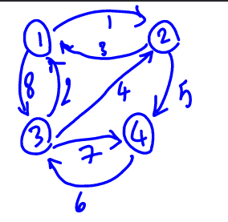

# floyd algorithm 
*to find shortest path between each vertix in graph*

it has an algorithm like prim's  [prim's algorithm](https://github.com/Babak01Gh/primAlgo)

**step1 :**
we give weighted matrix that contains value of edges between vertix(i) and vertix(j)
and it makes other matrix with the name "R" that contains k (mid vertix) that gives minimum value.

**step2 :**
algorithm takes each vertix the middle vertix and count again the value between vertix(i) and vertix(j)
with this formula : {min(i to j and i to k and k to j)}
and R[i][j] will be the k that gave min value in above formula

**step3 :**
and finally the first weighted matrix will be converted to minimum values of pathes between every vertix and the R matrix will contain in each index [i][j] required vertix in middle to get minimum value of path

## input graph
```
weighted = numpy.array([
    [0,1,8,infinit],
    [3,0,infinit,5],
    [2,4,0,7],
    [infinit,infinit,6,0]
])

#infinit means there is no direct path between
```

## output
```
weight matrix :
    [ 0.  1.  8.  6.]
    [ 3.  0. 11.  5.]
    [ 2.  3.  0.  7.]
    [ 8.  9.  6.  0.]

R matrix :
    [0 0 0 2]
    [0 0 1 0]
    [0 1 0 0]
    [3 3 0 0]
```

**this means if we want to go from 1 to 4 with the shortest path we have to pass vertix(2)** *R[1][4]=2* 

**and also to go from 1 to 2 we need to pass vertix(0) so it means go directly** *R[1][2]=0*

**and going from 2 to 4 also we need to pass 0 means go directly too** *R[2][4]=0*

**so we have (1->2->4) and value of this path is in final weight matrix**
*weight[1][4] = 6*

